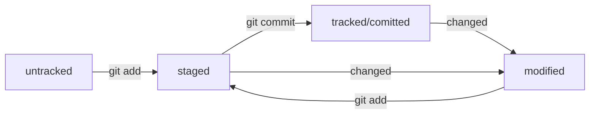

# Шпаргалка по командной строке

## Навигация

- `pwd` (от англ. ***p**rint **w**orking **d**irectory*, «показать рабочую папку») — покажи, в какой я папке;
- `ls` (от англ. ***l**i**s**t directory contents*, «отобразить содержимое директории») — покажи файлы и папки в текущей папке;
- `ls -a` — покажи также скрытые файлы и папки, названия которых начинаются с символа `.`;
- `cd first-project` (от англ. ***c**hange **d**irectory*, «сменить директорию») — перейди в папку `first-project`;
- `cd first-project/html` — перейди в папку `html`, которая находится в папке `first-project`;
- `cd ..` — перейди на уровень выше, в родительскую папку;
- `cd ~` — перейди в домашнюю директорию (`/Users/Username`);
- `cd /` — перейди в корневую директорию.

## Работа с файлами и папками

**Создание**

- `touch index.html` (англ. *touch,* «коснуться») — создай файл `index.html` в текущей папке;
- `touch index.html style.css script.js` — если нужно создать сразу несколько файлов, можно напечатать их имена в одну строку через пробел;
- `mkdir second-project` (от англ. ***m**a**k**e **dir**ectory*, «создать директорию») — создай папку с именем `second-project` в текущей папке.

**Копирование и перемещение**

- `cp file.txt ~/my-dir` (от англ. ***c**o**p**y*, «копировать») — скопируй файл в другое место;
- `mv file.txt ~/my-dir` (от англ. ***m**o**v**e*, «переместить») — перемести файл или папку в другое место.

**Чтение**

- `cat file.txt` (от англ. *con**cat**enate and print*, «объединить и распечатать») — распечатай содержимое текстового файла `file.txt`.

**echo**

- 'echo "Привет!"' - на экран
- 'echo "Вторая строка файла" >> file.txt' - добавляет строку в файл 
- 'echo "Новая строка" > file.txt' - перезапись информации в файле

**Удаление**

- `rm about.html` (от англ. ***r**e**m**ove*, «удалить») — удали файл `about.html`;
- `rmdir images` (от англ. ***r**e**m**ove **dir**ectory*, «удалить директорию») — удали папку `images`;
- `rm -r second-project` (от англ. ***r**e**m**ove,* «удалить» + ***r**ecursive*, «рекурсивный») — удали папку `second-project` и всё, что она содержит.

## Полезные возможности

- Команды необязательно печатать и выполнять по очереди. Можно указать их списком — разделить двумя амперсандами (`&&`).
- У консоли есть собственная память — буфер с несколькими последними командами. По ним можно перемещаться с помощью клавиш со стрелками вверх (**`↑`**) и вниз (**`↓`**).
- Чтобы не вводить название файла или папки полностью, можно набрать первые символы имени и дважды нажать `Tab`. Если файл или папка есть в текущей директории, командная строка допишет путь сама.
    
    Например, вы находитесь в папке `dev`. Начните вводить `cd first` и дважды нажмите `Tab`. Если папка `first-project` есть внутри `dev`, командная строка автоматически подставит её имя. Останется только нажать `Enter`.

## Инициализация репозитория

- `git init` - Сделать папку репозиторием. Сначала нужно переместиться в нее
- `rm -rf .git` - "разгитить" папку, если что-то пошло не так
- `git status` - Проверить состояние репозитория
- `git add` - Подготовить файлы к сохранению `git add file_name.ext` или `git add --all`. Cообщает Git, какие именно файлы нужно сохранить и какую их версию. 
- `git commit` или `git commit -m 'What has been changed'` - Выполнить коммит, само сохранение после  add.
- `git log` - Просмотреть историю коммитов.
- `git log --oneline` - Получить сокращённый лог

### Что такое SSH

SSH использует пару ключей для обеспечения безопасности — публичный и приватный: 
Приватный ключ (англ. private key) хранится только на вашем компьютере и не должен передаваться кому-либо ещё. Он используется для расшифровки данных.
Публичный ключ (англ. public key) доступен всем и используется для шифрования данных. Они могут быть расшифрованы парным приватным ключом.

Только вы можете расшифровать данные с помощью приватного ключа, но любой владелец публичного ключа может их для вас зашифровать. Эти два ключа связаны и образуют SSH-пару. В будущем вы наверняка будете использовать их для взаимодействия с GitHub и другими удалёнными серверами.

- `ls -la .ssh/` или `ls -a ~/.ssh` - Проверка наличия SSH-ключа (обычно в домашней директории)
- `ssh-keygen -t ed25519 -C "электронная почта, к которой привязан ваш аккаунт на GitHub"` - генерация ключа алгоритмом шифрования ed25519
- `ssh-keygen -t rsa -b 4096 -C "электронная почта, к которой привязан ваш аккаунт на GitHub"` - генерация ключа алгоритмом шифрования 4096
- `pbcopy < ~/.ssh/id_ed25519.pub` - Скопировать содержимое файла с публичным ключом в буфер обмена и вставить в настройки аккаунта GitHub.com
- `ssh -T git@github.com` - Проверьте правильность ключа

## Работа с репозиторием

- `git remote add origin git@github.com:%ИМЯ_АККАУНТА%/first-project.git` - Привязать удалённый репозиторий к локальному. `git@github.com:%ИМЯ_АККАУНТА%/first-project.git` взять из Quick setup репозитория (SSH).
- `git remote -v` - Убедиться, что репозитории связаны
- `git push -u origin main` или `git push -u origin master` - Отправить изменения на удалённый репозиторий. В дальнейшем при работе с удалённым репозиторием флаг `-u` можно опустить и писать просто `git push`.
- `git commit --amend --no-edit` - Дополнить коммит новыми файлами
- `git commit --amend -m "Новое сообщение"` - Изменить сообщение коммита
- `git restore --staged <file>` - Выполнить unstage изменений файла - сбросить из `staged` обратно в `untracked`/`modified`
- `git restore --staged .` - Выполнить unstage изменений в текущей папке
- `git reset --hard <commit hash>` - Откатить» коммит до <commit hash> (станет последним)
- `git restore <file>` - Откатить» изменения, которые не попали ни в staging, ни в коммит
- `git diff` - просмотр изменений в `modified` файлах
- `git diff <hash> HEAD` - разница между хешами коммитов
- `git diff --staged` - просмотр изменений в `staged` файлах
- `git clone git@github.com:%ИМЯ_АККАУНТА%/first-project.git` - Клонировать удалённый репозиторий на локальный компьютер


## Схема статусов файлов



## Игнорирование файлов в Git

Чтобы Git игнорировал файлы и не пытался добавить их в репозиторий, нужно создать файл `.gitignore`
 и записать в него названия игнорируемых файлов.

Файл `.gitignore` создают не при отправке готовой работы во внешний репозиторий, а задолго до того. 
Желательно даже вообще до создания первого локального коммита. 
Это обычный текстовый файл и он создаётся как и любой другой файл с кодом. 

- `git status --ignored` - Если нужно отобразить все игнорируемые файлы

### Правила заполнения

**Комментарий**

```
# вот так можно писать комментарии;
# они ничего не значат для .gitignore,
# но они могут быть полезны, чтобы понять, зачем было добавлено то или иное правило 
```

**Просто название файла**

```
# для macOS
.DS_Store  
```

**Звёздочка `*`**

```
# игнорировать все файлы, которые заканчиваются на .jpeg
*.jpeg

# игнорировать все файлы "tmp" во всех подпапках папки docs
docs/*/tmp  
```

**Вопросительный знак `?`**

```
# соответствует одному любому символу
file?.txt  
```

**Квадратные скобки `[…]`**

```
# игнорировать файлы file0.txt, file1.txt и file2.txt
# при этом не игнорировать file3.txt, file4.txt, ...
file[0-2].txt  
```

**Слеш `/`**

```
# игнорировать todo.txt в корне репозитория
/todo.txt

# для сравнения: spam.txt будет игнорироваться во всех папках
spam.txt  
```

**Парные звёздочки `**`**

```
# игнорировать файлы "docs/current/tmp", "docs/old/tmp",
# а также "docs/old/saved/a/b/c/d/tmp"
# и даже "docs/tmp", потому что ноль вложенных папок тоже подходит
docs/**/tmp

# игнорировать только "docs/current/tmp" и "docs/old/tmp"
# файл "docs/old/saved/a/b/c/d/tmp" не попадает в правило
docs/*/tmp  
```

**Восклицательный знак `!`**

```
# игнорировать все JPEG-файлы
*.jpeg

# но только не мем с Doge
!doge.jpeg  
```
